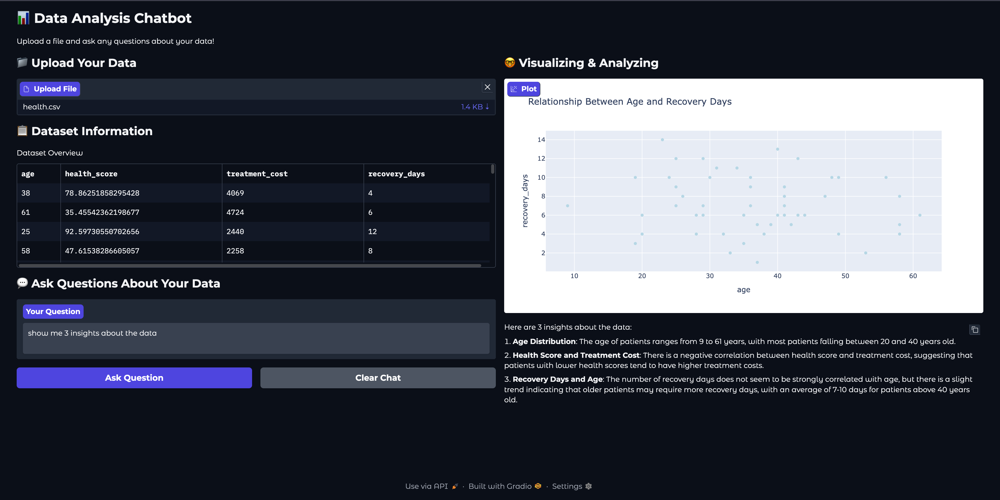

# DataAnalyst
**Upoload data file and ask questions, you're ready to go!**

This agent is designed to visualize your uploaded data, supporting basic graphs for low-demanding use scenarios. Meanwhile, the agent has been trained on a data analyzing dataset to better provide analysis report regarding user's question. We have chosen Llama3.3-70B-Instruct to synthesize training data, following a data cleaning process, resulting in 207 high-quality data samples. Due to compute constraints, we use QWen2.5-0.5B-Instruct as backbone LLM and conduct fine tuning. Nonetheless, using OpenAI models is preferred to eliminate possible extra hosting.



### Note
Currently, ONLY CSV file is processed, and the graphs will be decided from four types of graph: line, bar, pie, scatter. Yet more feature updates are coming soon!

## Quick start
### 😺 Environment
Basic python environment, conda or vm is fine.
```python
conda create -n data-agent python==3.11
conda activate data-agent
pip install -r requirements.txt
```
Set your OpenAI key and base url (if using proxy)
```python
export OPENAI_API_KEY=<api_key>
export OPENAI_BASE_URL=<base_url>
```
### 😼 Application
Set up gradio page and enjoy. 
```python
python run_ui.py
```
### 🤗 Fine-tuning
Synthesize data for later training. 1k data by default.
```python
python data_synthesis.py 
```
Then follow training script [train.ipynb](train.ipynb) to LORA-tuning your model using. GPU resources are depended on your chosen data and model. Results are saved in output directory.
